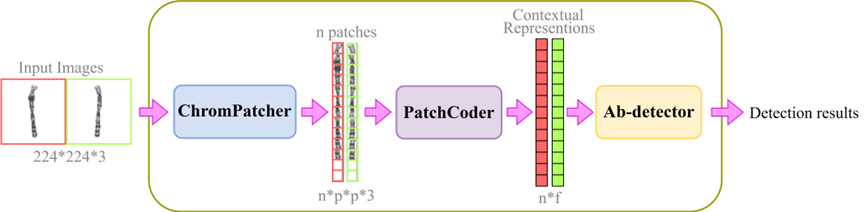

# Contrastive Predictive Coding for Chromosome anomaly detection

### Introduction



### Installation

首先创建python=3.8的环境。如果用conda，运行下面指令。

``conda create -n cpc python=3.8``

然后运行下面这两条指令

``pip install torch==2.1.0 torchvision==0.16.0 torchaudio==2.1.0 --index-url https://download.pytorch.org/whl/cu118``

``pip install -r requirements.txt``.

### Usage

API被封装在了[anomaly_detection.py](anomaly_detection.py)中
使用示例如下：
```python
import os
# 指定可用的GPU号
os.environ['CUDA_VISIBLE_DEVICES'] = 'X'  

from anomaly_detection import PatchDetector

detector = PatchDetector()
detector.build(use_gpu=True)

result = detector.detect(img1, 
                         img2, 
                         n,  # 染色体号数
                         ctype='G',  # 染色体类型（G、A、L）
                         use_gpu=True)
```

需要在应用前创建PatchDetector类的实例，然后调用build方法以加载训练好的参数到GPU上，
然后调用run方法获得检测结果。

### Preparation

在本项目下没有模型时，运行下面四步以获得模型和阈值文件。
获得模型和阈值文件后即可异常检测。

1. 运行[train_CPC.py](train_CPC.py)对 PatchCoder
进行预训练，得到TrainedModels/stl10文件夹下的模型文件。
（预训练用的数据集需要是经过cms_patch处理的，处理脚本见
[here](cms_dataset_helper/make_cms_patched_dataset.py)）

2. (可选) 运行[train_classifier.py](train_classifier.py)
测试PatchCoder中backbone的linear-probing效果，
即测试backbone特征提取的有效性。

3. 调用[anomaly_detection.py](anomaly_detection.py)
中的_save_similarities_between_normal_patch_X
函数获得数据集上所有成对染色体的相似度的统计数据（X=G,A,L），
得到根目录下的统计数据文件。

4. 调用[anomaly_detection.py](anomaly_detection.py)
中的_save_patch_thresholds_X函数来获得阈值T，
得到根目录下的阈值文件（X=G,A,L）。
